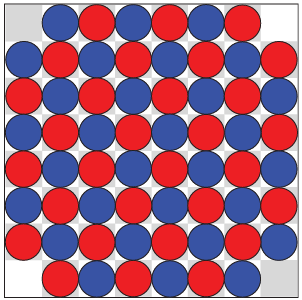
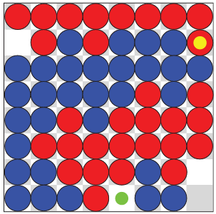
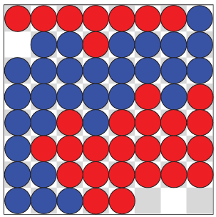
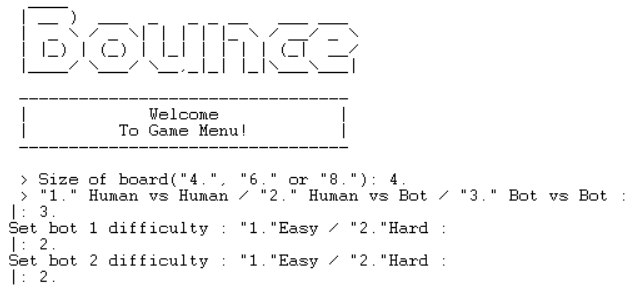
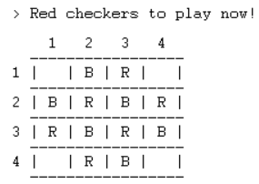
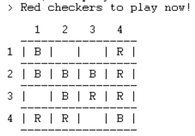

# Bounce Prolog

## Introdução
Bounce é um jogo de estratégia para dois jogadores, projetado por Mark Steere em agosto de 2023. Jogado num tabuleiro quadrado de tamanho par, o Bounce oferece uma experiência de jogo única. Este repositório contém uma implementação em Prolog do jogo.

O código está dividido por 6 ficheiros: 
- board.pl -> responsável pelo display e criação dos tabuleiros
- bot.pl -> contém todo o código relacionado com as jogadas efetuadas pelo computador (contém a "inteligência artificial")
- config.pl -> as configurações e regras do jogo são implementadas neste ficheiro
- data.pl -> apenas guarda as matrizes dos estados inciais de cada tabuleiro para facilitar a criação dos tabuleiros de jogo
- main.pl -> responsável pelo começo do jogo e gestão dos estados deste
- utils.pl -> todas as funções auxiliares estão presentes neste ficheiro

## Grupo
- **Membros do grupo e contribuição:**
  - João Brandão Alves up202108670 - 50%
  - Diogo Silva Leandro up202005304 - 50%

- **Identificação do grupo:**
  - Bounce_2

## Instalação e Execução
Para jogar o jogo, primeiro é preciso ter o SICStus Prolog 4.8 ou uma versão mais recente instalada na máquina, além da pasta com o source code(src).

De seguida, no interpretador do SICStus, consultar o ficheiro *main.pl* localizado no diretório root do source code:

```
?- consult('./main.pl').
```

Se a máquinas for em Windows, isto também pode ser feito ao selecionar `File` -> `Consult...` e selecionar o ficheiro `main.pl`.

Por fim, executar o predicado play/0 para entrar no menu principal do jogo:

```
?- play.
```

## Descrição do Jogo
Bounce é um jogo de estratégia para dois jogadores jogado num tabuleiro quadrado de tamanho par. O tabuleiro é inicialmente preenchido com peças vermelhas e azuis, com exceção dos cantos vazios.
O objetivo é simples: vencer ao final de cada turno, tendo todas as peças num grupo único.
Quem começa é o jogador Vermelho e, os jogadores alternam ao mover uma das suas peças para um quadrado desocupado, desde que isso resulte num grupo de peças da mesma cor maior. Se não houver jogadas legais, o jogador deve remover uma peça do tabuleiro.

Para mais informações consultar a [página oficial do jogo](chrome-extension://efaidnbmnnnibpcajpcglclefindmkaj/https://marksteeregames.com/Bounce_rules.pdf).

## Lógica do Jogo

### Representação Interna do Estado do Jogo
Durante a execução do jogo são guardados internamente vários dados importantes ao jogo, no predicado **game_state_stack/9**, representado na *main*, são guardados o estado atual do jogo, o tabuleiro atual, o jogador que está a jogar, o seu oponente, a quantidade de peças vermelhas, a quantidade de peças azuis e quem irá jogar no próximo turno (este úlitmo para facilitar o reconhecimento que um computador já jogou para o caso do jogo computador contra computador).


O tabuleiro é representado por uma lista de listas de dimensão size x size, cada elemento desta matriz representa uma casa do tabuleiro sendo que se o elemento for ' ' a casa encontra-se vazia, 'R' tem uma peça do jogador vermelho e 'B' se tem uma peça do jogador azul.
O jogo é jogado num tabuleiro quadrado de qualquer tamanho par (4 por 4, 6 por 6, ou 8 por 8, por opção nossa). Inicialmente o tabuleiro é preenchido com um padrão de tabuleiro de xadrez ou damas, compeças vermelhas e azuis, exeto nos cantos, como pode ser visto no próximo tópico.

### Visualização do Estado do Jogo

O visualização do jogo está ao encargo do predicado **display_game/1** que recebe o estado do tabuleiro e imprime na consola o resultado da maneira mais fácil de visualizar que conseguimos. Assim caso o predicado encontre um 'R' imprime um R, se encontrar um 'B' imprime um 'B' e se encontrar um ' ' imprime um espaço vazio representando assim as peças de ambos os jogadores. O estado inicial do jogo é assegurado pela função **initial_state/5**.

Quando o jogador inicia o jogo encontra o menu do mesmo. Este inicialmente pede diversos inputs ao jogador para definir bem a forma como este quer jogar.

Inicialmente pede qual o tamanho do tabuleiro é que o jogador quer, depois que tipo de jogo quer, se pessoa contra pessoa, computador contra pessoa ou computador contra computador, e por úlitmo caso seja escolhido algum modo que envolva computador irá ser pedido o nível de dificuldade a ser utilizado pela máquina.
*Para questão de visualização é recomendado o uso do tabuleiro de 4 por 4, pois quanto maior o tabuleiro, mais difícil fica a visualização*


|  |  |  |
|:--:|:--:|:--:|
| *Estado inicial do jogo* | *Exemplo de estado intermédio do jogo* | *Exemplo de estado final do jogo* |

|  |  |  |
|:--:|:--:|:--:|
| *Menu Inicial* | *Estado inicial real* | *Exemplo real de estado intermédio* |

### Validação e Execução de Movimentos 
Quando começa a jogada de algum dos utilizadores o predicado **move/2** é chamado. Este predicado verifica qual é, e qual o tipo de jogador (se é o computador ou um humano), e dependo destes dois valores chama os predicados adequados, **move_user/2** ou **bot_move/3**.

- Para jodadas humanas: Como mostrar uma lista com os movimentos possíveis era inviável devido à quantidade enorme de jogadas possíveis em algumas posições do tabuleiro, optamos por uma mecânica contrária. O utilizador insere uma jogada, e se esta não cumprir algum dos requisitos, é rejeitada e é pedida uma jogada nova. Cada jogada humana tem de representar uma coordenada dentro do tabuleiro, a peça selecionada tem que pertencer ao jogador que está a jogar, a peça tem que ser movida para uma coordenada vazia e a peça tem que ser movida de modo a pertencer a um grupo maior do que aquele a que pertencia antes de efetuar a jogada. Isto tudo é verificado com recurso às funções **check_valid_move/5**, **validate/3**, **move_user/2** e **bfs/4**. Caso não haja uma jogada legal, então é pedido ao jogador para remover uma das suas peças, sendo também todo o *input* verificado antes de remover a peça.

- Computador: Primeiro computa-se todas as jogadas possiveis que o computador pode executar com recurso à função **valid_moves/5**. De seguida, caso se trate do computador no nível fácil, a jogada efetuada será sempre a primeira encontrada e, caso se trate do computador no nível difícil a jogada efetuada será do tipo *greedy*, sendo escolhidas dentro de todas as jogadas possíveis, aquela que irá obter o maior valor na função *bfs*, ou seja, a que irá formar o maior grupo de peças em cada posição do tabuleiro. Caso não existam movimentos legais, ambos os computadores removem do tabuleiro a primera que encontrarem, pois como não é uma situação muito recorrente, não se justificava a implementação de um algoritmo complexo para efetuar a remoção de uma peça.

A escolha das jogadas por parte dos jogadores humanos é feito com os predicados **read_piece/2** e **read_move/2** que recebem o *inputs* dos jogadores.

### Lista de Movimentos Válidos
Todas as jogadas válidas podem ser obtidas usando o predicado **valid_moves/5**, tal como referido anteriormente, mas que é apenas usada pelo computador pois a quantidade de movimentos possíveis para o jogador seria inútil, pois em algumas posições teriam de ser mostradas mais de 100 jogadas possíveis, o que não nos pareceu viável.

### Fim de Jogo
Para detetar quando o jogo acaba são usados os predicados **get_win/4** e **game_over/2** que verificam, respetivamente, se um jogador ou o computador conseguiu fazer um grupo com todas as peças do jogo, e mostrar o vencedor e perguntar ao jogador o que quer fazer depois do final do jogo.

### Avaliação do Estado do Jogo
Para conseguirmos avaliar o estado do tabuleiro precisamos de ter em atenção várias métricas tais como o número de peças de cada jogador no tabuleiro e a posição relativa destas peças. O valor de cada jogada pode ser calculado pelo **bfs/5**, que retorna um número inteiro a cada jogada especifica que representa o tamanho do grupo em que a peça irá ficar. A função responsável por alterar o *game state* ao longo da execução do jogo é a função **check_valid_move/5**, fazendo uso da função **game_state_pack/9**.

### Jogada do Computador
Na jogada do computador primeiro é verificado se o bot está no nivel fácil ou díficil através do GameState (para os níveis de dificuldade é usado 1 para fácil e 2 para difícil), para os dois casos primeiro obtêm-se todas as jogadas legais usando o predicado **valid_moves/5**. Em seguida, caso se trate do bot fácil é escolhida a primeira jogada encontrada. Caso se trate do bot dificil escolhe-se a melhor jogada possivel usando o predicado **choose_move/9** que verifica para todas as jogadas, qual o tamanho do novo grupo que iria criar, e escolhe o movimento que irá gerar o maior grupo.

## Conclusões
Ao fazer este projeto, tivemos a oportunidade de explorar uma linguagem que não era familiar para nós e de nos familiarizarmos com um paradigma de programação completamente diferente daqueles com os quais estamos acostumados. Isso desafiou-nos a pensar de maneira um pouco diferente.

As principais limitações do nosso trabalho estão relacionadas aos predicados de manipulação de listas, uma vez que esses não são trivialmente implementados em Prolog. É provável que os predicados que desenvolvemos para esse fim não estejam otimizados da melhor maneira possível.

Algumas melhorias que poderiam ser aplicadas a este projeto incluem a otimização dos predicados mencionados anteriormente.

## Bibliografia
- Documentação da unidade curricular
- [Documentação do SWI Prolog](https://www.swi-prolog.org/)
- [Página oficial do jogo](chrome-extension://efaidnbmnnnibpcajpcglclefindmkaj/https://marksteeregames.com/Bounce_rules.pdf)